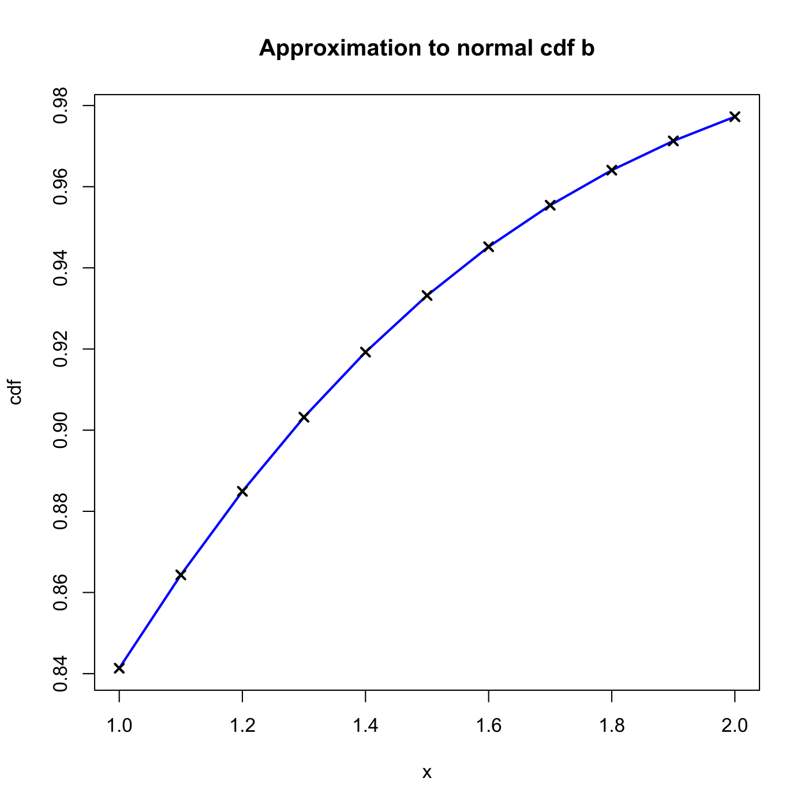

[](http://quantlet.de/index.php?p=info)

## [](http://quantlet.de/) **SFENormalApprox2** [](http://quantlet.de/d3/ia)

```yaml

Name of QuantLet : SFENormalApprox2

Published in : Statistics of Financial Markets

Description : 'Computes numerical approximation to a normal cumulative distribution function (cdf)
using method b).'

Keywords : 'approximation, cdf, distribution, graphical representation, normal,
normal-distribution, numeric, plot'

See also : SFENormalApprox1, SFENormalApprox3, SFENormalApprox4

Author : Wolfgang K. Haerdle

Submitted : Mon, November 24 2014 by Awdesch Melzer

Output: 
- phi: approximation of Normal cdf at different values

Example : 'Estimated normal cdf at that points 1:0.1:2 are given: [0.8413 0.8643 0.8849 0.9032
0.9192 0.9332 0.9452 0.9554 0.9641 0.9713 0.9772].'

```




```r

# clear variables and close windows
rm(list = ls(all = TRUE))
graphics.off()

# Main computation
y = 10:20
y = y/10
b = 0.231641888
a1 = 0.127414796
a2 = -0.142248368
a3 = 0.71070687
a4 = -0.726576013
a5 = 0.530702714
t = 1/(1 + b * y)
phi = 1 - (a1 * t + a2 * t^2 + a3 * t^3 + a4 * t^4 + a5 * t^5) * exp(-y * y/2)

# plot
plot(y, phi, col = "blue", type = "l", main = "Approximation to normal cdf b", 
    xlab = "x", ylab = "cdf", lwd = 2)
points(y, phi, col = "black", pch = 4, lwd = 2)

```
